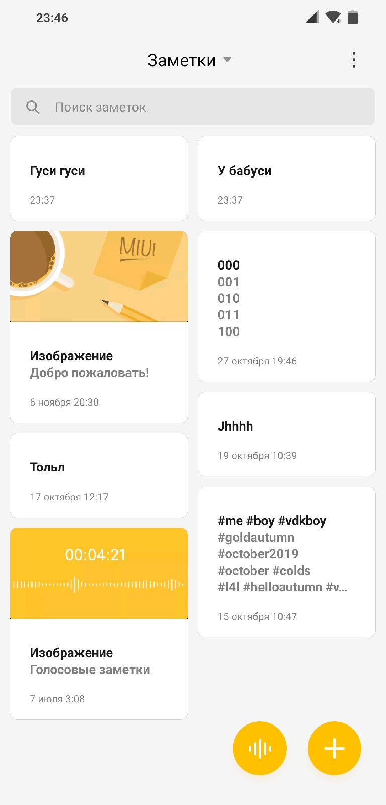
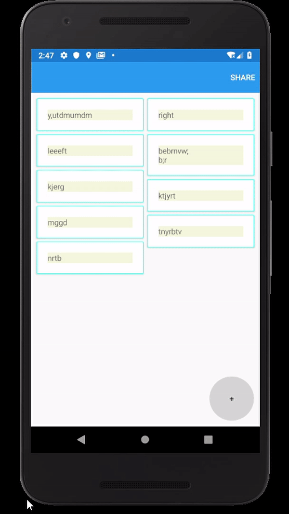
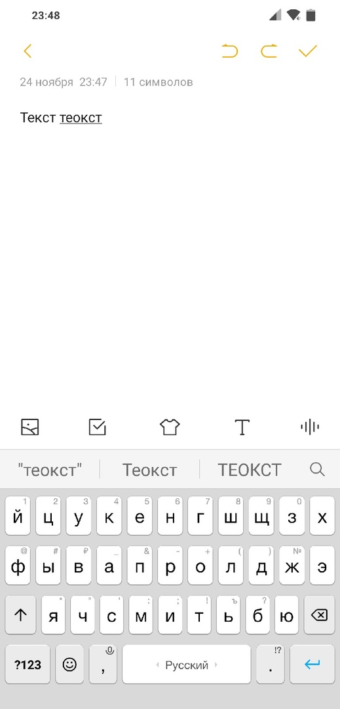
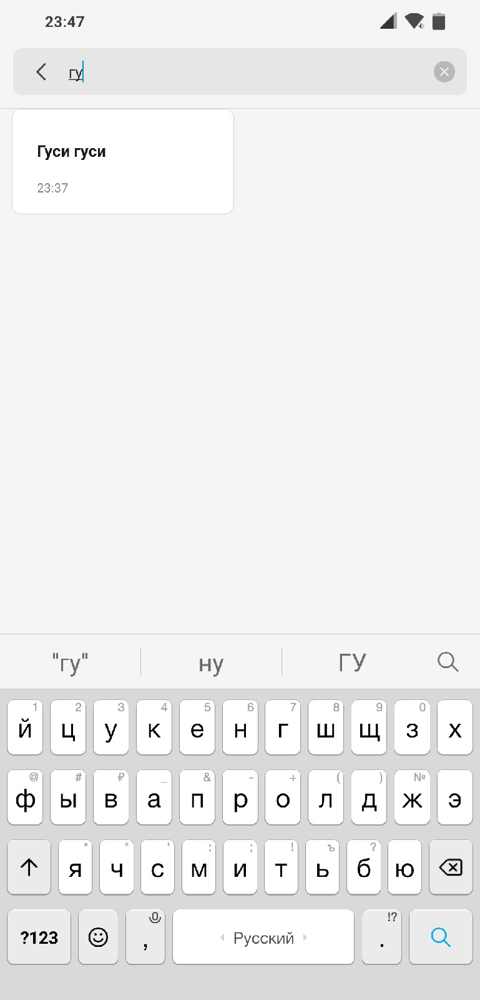

# HW2
## Основное меню

* Добавляемые заметки должны ровномерно распределяться в левую и правую колонки.
* В основном меню Swipe нужно заменить на Pan.
* При перетаскивании Frame не должен выходить за середину. То есть правый фрейм должен перемещаться только вправо. Левый только влево. Пример ниже.

* При удалении заполненность колонок должна выровниться. То есть не должно быть как на примере ниже (Один фрейм слева должен был переместиться вправо).
* Добавить ограничение отображаемого текста. Использовать LineBreakMode 
## Окно редактирования текста

* Убрать сохранение по нажатию на кнопку плюс. Сохранение будет происходить сразу после выхода со страницы
* Указывать дату написания заметки и/или последнего редактирования
* Вести подсчет символов

## Возможные допы к заданию
Делать эти пункты не надо, но надо иметь ввиду то, что какой-то из них я дам на выполнение. Соответственно код должен быть гибким.

### В основном окне:
* Поиск заметок по подстроке

* Перемещение/Ручная сортировка фреймов
* Массовое удаление выбранных заметок

### В окне редактирования:
* Внедрить Markdown редактор
* Добавить кнопку Share для открытой заметки в Title menu
* Добавить кнопки Undo и Redo
* Вместо сохранения по выходу из заметки, сделать сохранение по кнопке, которая будет расположена в Title menu
