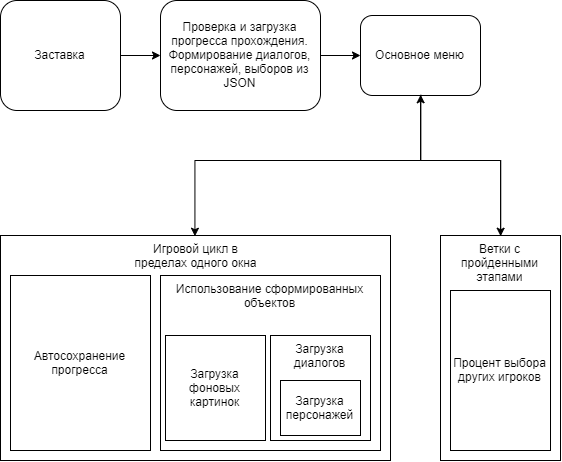
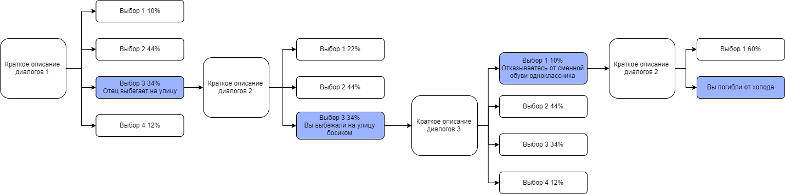

# HW3 Novella

## Игровой цикл


* ```profile.json``` - хранит пройденные диалоги и активный. Дефолтный профиль создается при первом запуске игры
  - ```"closed"``` - проигранные диалоги
  - ```"active"``` - активный диалог
```json
"dialogs" : {
    "closed" : [
        "dialog1",
        "dialog2"
    ],
    "active" : "dialog3"
}
```
* ```dialog1.json```, ```dialog2.json```, ... - запускаемые диалоги. Проигранный диалог записывается в profile.json
  * ```background``` - фон во время диалога
  * ```steps``` - Шаги диалога
    * ```npc``` - Персонаж, который произносит текст
    * ```text``` - Произносимый текст
    * ```message``` - Отправит ```Message.Send``` для выполнения специфичного кода
  * ```options``` - Настройка окна с выбором
    * ```npc``` - Персонаж, который задал вопрос
    * ```text``` - Произносимый текст
    * ```message``` - Отправит ```Message.Send``` для выполнения специфичного кода
    * ```selectors``` - Кнопки с выбором ответа кода
      * ```text``` - Текст выбора
      * ```dialogTrigger``` - Запускаемый диалог
      * ```message``` - Отправит ```Message.Send``` для выполнения специфичного кода
```json
"dialog" : {
    "background" : "image1",
    "steps" : [
        {
            "npc" : "npc.name1",
            "text" : "some text",
            "message" : "throwAction1"
        },
        {
            "npc" : "npc.name1",
            "text" : "some text"
        },
        {
            "npc" : "npc.name2",
            "text" : "some text",
            "message" : "throwAction2"
        }
    ],
    "options" :
    {
        "npc" : "npc.name1",
        "text" : "some text",
        "message" : "throwAction2",
        "selectors" : [
            {
                "text" : "some text 2",
                "dialogTrigger" : "dialog2",
                "message" : "throwAction2"
            },
            {
                "text" : "some text 3",
                "dialogTrigger" : "dialog3",
                "message" : "throwAction3"
            },
            {
                "text" : "some text 4",
                "dialogTrigger" : "dialog4"
            }
        ]
    }
}
```
* ```npc.json``` - настройки персонажей
  * ```npc``` - персонажи по айди
    * ```image``` - картинка персонажа
    * ```name``` - имя персонажа
    * ```main_theme``` - фоновый тематический звук персонажа (возможный доп)
    * ```transform``` - Настройка положения, ширины и высоты
    * ```show_animation``` - анимация появления (возможный доп)
```json
"npc" : {
    "npc.id1" :
    {
        "image" : "path",
        "name" : "Kujo",
        "main_theme" : "sound", // additional maybe 
        "transform" :
        {
            // size settings
        },
        "show_animation" :
        {
            // additional maybe
        }
    },
    "npc.id2" :
    {
        "image" : "path",
        "name" : "Dio",
        "transform" :
        {
            // size settings
        }
    }
}
```
* ```backgrounds.json``` - настройки фонов
  * ```backgrounds``` - названия фонов
    * ```image``` - картинка фона
    * ```main_theme``` - фоновый тематический звук фона (возможный доп)
    * ```transform``` - Настройка положения, ширины и высоты
```json
"backgrounds" : {
    "backgrounds1" :
    {
        "image" : "path",
        "main_theme" : "sound", // additional maybe 
        "transform" :
        {
            // size settings
        }
    },
    "backgrounds2" :
    {
        "image" : "path",
        "transform" :
        {
            // size settings
        }
    }
}
```

* Фон должен плавно сменяться на другой

### Возможные допы:

* Разная мелодия в зависимости от локации
* Разная музыка в зависимости от персонажа
* Анимация появления персонажа
* Анимированный фон
* Анимированные персонажи

## Пример ветки с выборами



### Возможные допы:

* При клике на диалог, включится его автопроигрывание и последующее закрытие
* Процент выбора игроков
