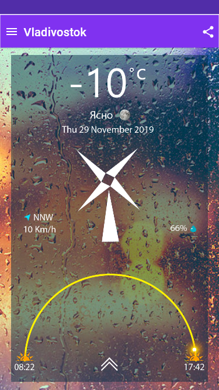
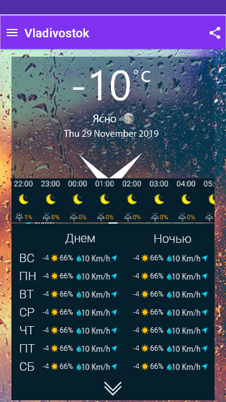
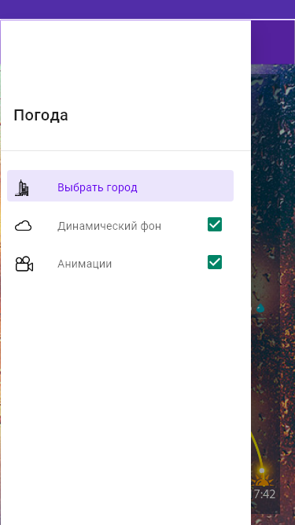
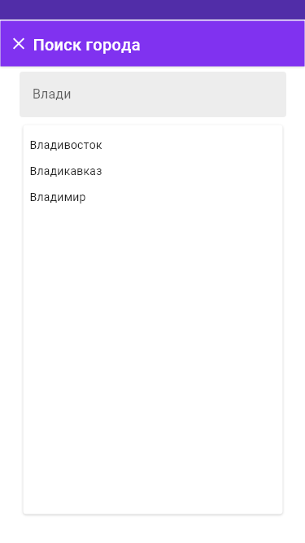

# HWG

Макет открывать в AdobeXD.

Приложение должно работать с OpenWeatherMapApi.

На основной странице отображается информация о городе из текущего местоположения. Если доступа к местоположению нет, то отображается информация о погоде в г.Москва.
При отсутствии интернета, уведомить об этом пользователя.
Если соединение пропало, то предыдущее состояние погоды должно остаться на экране.
Погоду по умолчанию обновлять информацию каждые пять минут.
Страница содержит винт, скорость прокрутки которого зависит от скорости ветра.
Значок направления указывает на направление ветра.
На фоне меняются картинки или видео в зависимости от погоды. Фон должен быть анимирован.
Добавить дугу санрайз-сансет. По свайпу вверх открывается форекаст.
В менюшках можно выбрать город, при наборе текста всплывает автодополнение с городами на русском и английском языках.
Можно выбрать город из списка уже однажды выбранных городов.
Анимацию винта и фона можно отключить.
При нажатии на кнопку Share, формируется следующий текст:
Title: Погода в городе %город_нейм%  
Text: На данный момент температура в городе %город_нейм%  
равна %температура%.  
Влажность %влажность%.  
Скорость ветра %скорость%.  
Направление ветра %направление%.  
Состояние погоды: %солнечно/облачно/дождь%  

50%

* 01% - Уведомление об отсутствии интернета
* 01% - Москва по умолчанию
* 05% - Город выбирается в зависимости от местоположения, если пользователь дал на это соглашение
* 01% - Отображается название города
* 02% - Кнопка Share формирует информацию о погоде в выбранном городе
* 02% - Отображается текущая температура в выбранном городе
* 02% - Отображается текущее состояние погоды в выбранном городе. Например ясно, облачно или дождь
* 02% - Отображается текущая дата в выбранном городе
* 05% - Добавлен анимированный вентилятор и его скорость зависит от скорости ветра
* 05% - Добавлен анимированный фон, изображение которого зависит от погоды
* 03% - Указано направление ветра стрелочкой, буквенно и указана скорость ветра
* 02% - Указана влажность, есть значок
* 15% - Реализован санрайз-сансет
* 04% - По свайпу вверх открывается форекаст. По клику на стрелочки открывается форекаст. Присутствует анимация открытия

25%

* 9% - На форекасте присутствует скролл влево-вправо с погодой по часам. Отображается время, состояние погоды, температура и влажность
* 12% - На форекасте присутствует список с погодой по следующим лням недели. Отображается погода на день и ночь. Отображается день недели, состояние погоды, температура, направление ветра стрелочкой, скорость ветра и влажность
* 04% - По свайпу вниз закрывается форекаст. По клику на стрелочки закрывается форекаст

10%

* 01% - В списке меню есть оглавление и список, содержащий картинки, текст и чекбоксы
* 01% - По кнопке "Выбрать город" осуществляется переход на страницу выбора города
* 04% - Динамический фон отключается, настройка сохраняется
* 04% - Вентилятор отключается, настройка сохраняется

5%

* 05% - Отображается список ранее выбранных городов. Нажав на город происходит переход на главную страницу. Отображается погода выбранного города

10%

* 02% - Можно выбрать город напечатав его название или указав координаты
* 08% - При наборе текста русским или английским языком всплывает автодополнение с городами

Картинки погоды(солнечно, облачно, дождь, и т.д. брать с OpenWeatherMap API

https://openweathermap.org/current

https://openweathermap.org/forecast5

https://openweathermap.org/weather-conditions
