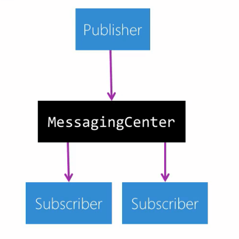
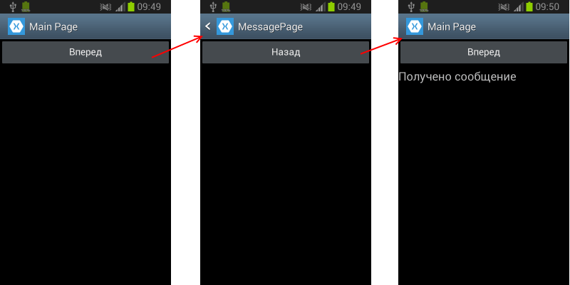

# Lesson 2

## Делегаты

Делегат - указатель на метод. 

Объявление делегата:
```cs
delegate void MyDelegate();
```
В качестве возвращаемого значения используется void. Принимаемых значений нет.
Пример использования:
```cs
class Program
{
    delegate void MyDelegate(); // Объявление делегата
 
    static void Main(string[] args)
    {
        MyDelegate mes1; // Создание переменной делегата
        mes1 = Foo; // Присвоение значения делегату
        MyDelegate mes2 = Bar;
        MyDelegate mes3 = new MyDelegate(Baz);
        MyDelegate mes4;
        mes1(); // Вызываем метод
        mes2();
        mes3();
        // mes4(); // NullReferenceException
        mes4?.Invoke(); // Проверка на нулл и последующий вызов методов при != null

        // Добавление методов в делегат
        mes3 += Bar;
        
        mes3(); // Вызовется Bar и Baz

        mes3 -= Baz;
        
        mes3(); // Вызовется Bar

        // Объединение делегатов
        mes3 += mes2;
        
        mes3(); // Вызовется Bar и Baz

        Console.ReadKey();
    }
    private static void Foo()
    {
        Console.WriteLine("Foo");
    }
    private static void Bar()
    {
        Console.WriteLine("Bar");
    }
    private static void Baz()
    {
        Console.WriteLine("Baz");
    }
}
```

Делегаты можно передовать как параметры методов

```cs
class Program
{
    delegate void MyDelegate();
 
    static void Main(string[] args)
    {
        Show_Message(Foo);
        Show_Message(Bar);
        Console.ReadLine();
    }
    private static void Show_Message(MyDelegate _del)
    {
        _del?.Invoke();
    }
    private static void Foo()
    {
        Console.WriteLine("Foo");
    }
    private static void Bar()
    {
        Console.WriteLine("Bar");
    }
}
```

Обобщенные делегаты
Делегаты могут быть обобщенными, например:

```cs
delegate T MyDelegate<T, K>(K val);
 
class Program
{
    static void Main(string[] args)
    {
        MyDelegate<double, int> foo = Foo;
        Console.WriteLine(foo(5));
        Console.Read();
    }
 
    static double Foo(int n)
    {
        return n / 2.0f;
    }
}
```

## Анонимные методы

Анонимные методы используются для создания экземпляров делегатов.

Определение анонимных методов начинается с ключевого слова delegate, после которого идет в скобках список параметров и тело метода в фигурных скобках:

```cs
delegate(параметры)
{
    // инструкции
}
```

Например:

```cs
class Program
{
    delegate void MessageHandler(string message);
    static void Main(string[] args)
    {
        string a = "123";
        MessageHandler handler = delegate(string mes)
        {

            //Анонимный метод имеет доступ ко всем переменным, определенным во внешнем коде.
            Console.WriteLine($"{mes} {a}");
        };
        handler("hello world!");
        Console.Read();
    }
}
```

Анонимный метод не может существовать сам по себе, он используется для инициализации экземпляра делегата, как в данном случае переменная handler представляет анонимный метод. И через эту переменную делегата можно вызвать данный анонимный метод.

И важно отметить, что в отличие от блока методов или условных и циклических конструкций, блок анонимных методов должен заканчиваться точкой с запятой после закрывающей фигурной скобки.

Анонимные делегаты можно передавать в качестве параметра функции.

В каких ситуациях используются анонимные методы? Когда нам надо определить однократное действие, которое не имеет много инструкций и нигде больше не используется.

## Лямбды

Лямбда-выражения представляют упрощенную запись анонимных методов. Лямбда-выражения позволяют создать емкие лаконичные методы, которые могут возвращать некоторое значение и которые можно передать в качестве параметров в другие методы.

Синтаксис:
```cs
(параметр1, параметр2, ...) => выражение
```

Например:

```cs
class Program
{
    delegate int Operation(int x, int y);
    static void Main(string[] args)
    {
        Operation operation = (x, y) => x + y;
        Console.WriteLine(operation(10, 20));       // 30
        Console.WriteLine(operation(40, 20));       // 60
        Console.Read();
    }
}
```

Здесь код `(x, y) => x + y`; представляет лямбда-выражение, где `x` и `y` - это параметры, а `x + y` - выражение. При этом нам не надо указывать тип параметров, а при возвращении результата не надо использовать оператор return.

Если лямбда-выражение принимает один параметр, то скобки вокруг параметра можно опустить.

Как и делегаты, лямбда-выражения можно передавать в качестве аргументов методу для тех параметров, которые представляют делегат.

## Делегаты Action, Predicate и Func

В .NET есть несколько встроенных делегатов, которые используются в различных ситуациях. И наиболее используемыми, с которыми часто приходится сталкиваться, являются `Action`, `Predicate` и `Func`.

### Action
Делегат Action является обобщенным, принимает параметры и возвращает значение void:

```cs
public delegate void Action<T>(T obj)
```
Данный делегат имеет ряд перегруженных версий. Каждая версия принимает разное число параметров: от `Action<in T1>` до `Action<in T1, in T2,....in T16>`. Таким образом можно передать до 16 значений в метод.

Как правило, этот делегат передается в качестве параметра метода и предусматривает вызов определенных действий в ответ на произошедшие действия. Например:

```cs
static void Main(string[] args) 
{
    Action<int, int> op;
    op = Add;
    Operation(10, 6, op);
    op = Substract;
    Operation(10, 6, op);
 
    Console.Read();
}
 
static void Operation(int x1, int x2, Action<int, int> op)
{
    if (x1 > x2)
        op(x1, x2);
}
 
static void Add(int x1, int x2)
{
    Console.WriteLine("Сумма чисел: " + (x1 + x2));
}
 
static void Substract(int x1, int x2)
{
    Console.WriteLine("Разность чисел: " + (x1 - x2));
}
```

### Predicate
Делегат `Predicate<T>`, как правило, используется для сравнения, сопоставления некоторого объекта `T` определенному условию. В качестве выходного результата возвращается значение `true`, если условие соблюдено, и `false`, если не соблюдено:

```cs
Predicate<int> isPositive = delegate (int x) { return x > 0; };
Console.WriteLine(isPositive(20));
Console.WriteLine(isPositive(-20));
```

### Func
Еще одним распространенным делегатом является Func. Он возвращает результат действия и может принимать параметры. Он также имеет различные формы: от `Func<out T>()`, где `T` - тип возвращаемого значения, до `Func<in T1, in T2,...in T16, out TResult>()`, то есть может принимать до 16 параметров.

Пример использования:
```cs
static void Main(string[] args) 
{
    Func<int, int> retFunc = Factorial;
    int n1 = GetInt(6, retFunc);
    Console.WriteLine(n1);  // 720
     
    int n2 = GetInt(6, x=> x *x);
    Console.WriteLine(n2); // 36
     
    Console.Read();
}
 
static int GetInt(int x1, Func<int, int> retF)
{
    int result = 0;
    if (x1 > 0)
        result = retF(x1);
    return result;
}
static int Factorial(int x)
{
    int result = 1;
    for (int i = 1; i <= x; i++)
    {
        result *= i;
    }
    return result;
}
```

## Шаблоны

Предположим, необходимо разработать класс / метод, который работал бы с разными типами данных. Пока мы еще не знаем шаблонов, решением кажется создания отдельного метода для каждого типа данных. Другим решением может оказаться использование типа Object. Однако и подобный вариант крайне сомнителен: неудобен, небезопасен и нерационален с точки зрения использования памяти. Именно в данном случае следует использовать шаблоны. Синтаксис достаточно прост.

```cs
public void DoAny<T>(T val1, T val2, T val3);
```

В данном случае метод DoAny может обработать любой переданный ему тип данных. Буква T в треугольных скобках говорит о шаблонности метода. Следует заметить, что может быть использован любой другой символ. Однако общепринятым считается именно символ T (template — шаблон). Далее, эта буква будет меняться на тип данных, используемый нами при вызове метода. Использование шаблонных методов так же достаточно просто.

```cs
DoAny<int> (1, 2, 3); 
DoAny<char> ('a', 'b', 'c');
```

В треугольных скобках указывается тип данных, который будет использоваться при выполнении метода. Однако следует заметить, что такая попытка вызова метода приведет к ошибке:

```cs
DoAny<string> ("a", 2, 3.14);
```

Обобщенный класс:

```cs
public class TemplateTest<T>
{
    T foo;
}
```

Также можно указать, какие именно значения будет принимать T, например:

```cs
public class TemplateTest<T> where T: <Holder>
{
    T foo;
}
```

Вместо `<Holder>` может быть:
* Class. Шаблон создается для классов, не объявленных как sealed.
* struct. Использование шаблонов на основе структур.
* new(). Параметр <T> должен быть классом, обладающим конструктором по умолчанию.
* Имя_класса. Шаблон поддерживает использование типов данных, являющихся наследником указанного.
* Имя_интерфейса. Использование классов, которые реализуют указанный интерфейс.

К примеру, при подобном объявлении класса.

```cs
public class TemplateTest<T> where T : IEnumerable
```

Таким образом в качестве типа T сможет использоваться любой другой тип, который реализует интерфейс перечисления, например, List, Array или любой другой созданный тобой тип от данного интерфейса.

Подводя итог, обобщения C# позволяют выполнять типобезопасные операции с коллекциями и не только, при этом конкретный тип можно задавать на позднем этапе написания и использования кода. Generics C# очень популярный и мощный инструмент программирования, которым обязательно нужно научиться пользоваться на практике.

## Сообщения и MessagingCenter

Xamarin Forms поддерживает такую функциональность, как отправку сообщений. Для этого в Xamarin определен класс MessagingCenter, который поддерживает ряд методов:

* `Send<TSender>(TSender sender, string message)`: посылает сообщение message, в качестве отправителя выступает объект TSender
* `Subscribe<TSender>(object subscriber, string message, Action<TSender> callback)`: устанавливает подписку для объекта subscriber на получение сообщения message. При получении события будет вызываться действие callback
* `Unsubscribe<TSender>(object subscriber, string message)`: прекращает подписку для объекта subscriber на сообщение message

MessagingCenter работает по принципу подписки или Publisher-Subscriber:


Рассмотрим применение сообщений на примере. Добавим в проект класс страницы, который назовем MessagePage:

```cs
using System;
using Xamarin.Forms;
 
namespace NavigationApp
{
    public class MessagePage : ContentPage
    {
        public MessagePage()
        {
            Title = "MessagePage";
            Button backBtn = new Button
            {
                Text = "Назад"
            };
            backBtn.Clicked += GoToBack;
 
            Content = new StackLayout { Children = { backBtn} };
        }
        // Переход обратно на MainPage
        private async void GoToBack(object sender, EventArgs e)
        {
            // отправляем сообщение
            MessagingCenter.Send<Page>(this, "LabelChange");
            await Navigation.PopAsync();
        }
    }
}
```

Здесь определена одна кнопка для возврата на предыдущую страницу. При возврате с помощью метода MessagingCenter.Send отправляется сообщение. Название сообщения - "LabelChange". В качестве отправителя установлен текущий объект, поэтому метод типизирован типом Page. Хотя можно было бы и конкретизировать тип отправителя:

```cs
MessagingCenter.Send<MessagePage>(this, "LabelChange");
```

Таким образом, сообщение отправляется. Теперь подпишемся на это событие. Пусть у нас есть главная страница MainPage:

```cs
using System;
using Xamarin.Forms;
 
namespace NavigationApp
{
    public partial class MainPage : ContentPage
    {
        Label stackLabel;
        public MainPage()
        {
            Title = "Main Page";
            Button forwardButton = new Button
            {
                Text = "Вперед"
            };
            forwardButton.Clicked += GoToForward;
 
            stackLabel = new Label
            {
                FontSize = Device.GetNamedSize(NamedSize.Large, typeof(Label))
            };
            Content = new StackLayout { Children = { forwardButton, stackLabel } };
            // устанавливаем подписку на сообщения
            Subscribe();
        }
        // установка подписки на сообщения
        private void Subscribe()
        {
            MessagingCenter.Subscribe<Page>(
                this, // кто подписывается на сообщения
                "LabelChange",   // название сообщения
                (sender)=> { stackLabel.Text = "Получено сообщение"; });    // вызываемое действие
 
        }
        // Переход вперед на MessagePage
        private async void GoToForward(object sender, EventArgs e)
        {
            MessagePage page = new MessagePage();
            await Navigation.PushAsync(page);
        }
    }
}
```

Здесь определена кнопка для перехода к странице MessagePage, и также определен метод подписки на сообщение, в котором вызывается MessagingCenter.Subscribe. Причем метод MessagingCenter.Subscribe типизирован именно тем типом, который является отправителем, то есть тип Page.

Получателем является текущий объект, поэтому в метод передается в качестве первого параметра this.

Название сообщения должно совпадать с тем, которое используется при отправке, то есть в нашем случае "LabelChange".

Третий параметр - действие просто выполняет установку текста метки, хотя тут могла бы быть и более сложная логика.

Ну и в главном классе приложения App страница MainPage должна передаваться в NavigationPage:

```cs
using Xamarin.Forms;
 
namespace NavigationApp
{
    public partial class App : Application
    {
        public App()
        {
            MainPage = new NavigationPage(new MainPage());
        } 
 
        protected override void OnStart()
        {}
 
        protected override void OnSleep()
        {}
 
        protected override void OnResume()
        {}
    }
}
```

Теперь запустим приложение и перейдем с MainPage на MessagePage и обратно:



1. Делегаты https://metanit.com/sharp/tutorial/3.13.php
2. Анонимные методы https://metanit.com/sharp/tutorial/3.15.php
3. Лямбды https://www.bestprog.net/ru/2017/11/16/lambda-expressions-general-concepts-of-lambda-expressions-lambda-operator-single-and-block-lambda-expressions_ru/#q01
https://metanit.com/sharp/tutorial/3.16.php
4. Делегаты Action, Predicate и Func https://metanit.com/sharp/tutorial/3.33.php
5. Шаблоны http://www.dream-land.by/developer/csharp/class_template/
https://shwanoff.ru/generics/
6. Сообщения и MessagingCenter https://metanit.com/sharp/xamarin/5.4.php
# Homework

TODO: Description