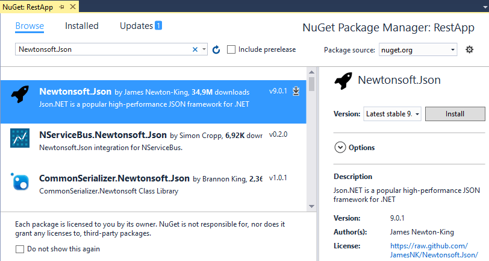
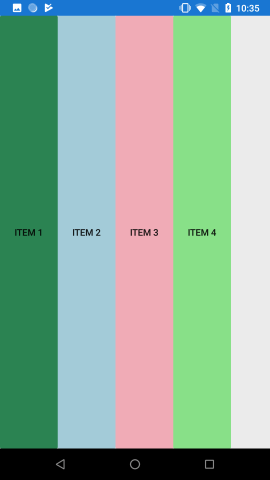
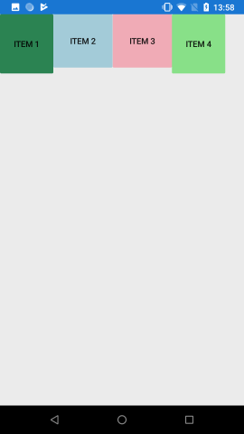
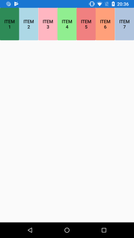
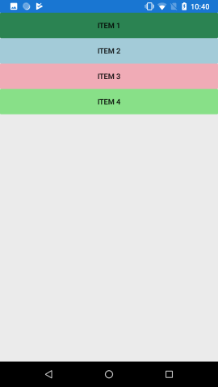
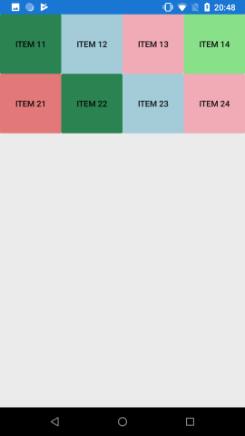

[Домой](https://pavlenkodr.github.io/XamarinStudents/)

# Lesson 3

## HttpClient

Для взаимодействия с веб-сервисами в .NET используется класс `HttpClient`. С помощью его методов можно посылать определенный запрос к серверу.
По умолчанию проект Xamarin.Forms не содержит функционала HttpClient, поэтому его надо вручную добавлять в проект через NuGet установив `System.Net.Http`

### Работа с HttpClient

`HttpClient` предоставляет следующие методы:
* `GetAsync()`: отправляет запрос типа `Get`
* `DeleteAsync()`: отправляет запрос типа `Delete`
* `PostAsync()`: отправляет запрос типа `Post`
* `PutAsync()`: отправляет запрос типа `Put`
* `SendAsync()`: отправляет запрос любого типа в зависимости от настроек заголовков запроса. Выше определенные методы являются частными случаями данного метода
* `GetByteArrayAsync()`: отправляет массив байтов в запросе типа `Get`
* `GetStreamAsync()`: отправляет поток Stream в запросе типа `Get`
* `GetStringAsync()`: отправляет строку в запросе типа `Get`

При отправке запроса для его настройки мы можем применять объект класса `HttpRequestMessage`. В частности, для конфигурации запроса можно использовать следующие свойства класса:
* `Content`: отправляемые данные
* `Headers`: заголовки http
* `Method`: метод отправки(`Get`/`Post`/`Put`/`Delete`)
* `RequestUri`: адрес сервера

После выполнения запроса мы можем получить ответ в виде объекта класса `HttpResponseMessage`. Для обработки ответа мы можем воспользоваться следующими свойствами данного класса:
* `Content`: полученные данные
* `Headers`: заголовки ответа, полученные от сервера
* `StatusCode`: статусный код ответа

Например:
```cs
HttpClient client = new HttpClient();
HttpRequestMessage request = new HttpRequestMessage();
request.RequestUri = new Uri("http://somesite.com");
request.Method = HttpMethod.Get;
request.Headers.Add("Accept", "application/json");
 
HttpResponseMessage response = await client.SendAsync(request);
if(response.StatusCode==HttpStatusCode.OK)
{
    HttpContent responseContent = response.Content;
    var json = await responseContent.ReadAsStringAsync();
}
```

Если сервер отправляет нам данные в виде json, то, получив данные в виде строки с помощью метода `responseContent.ReadAsStringAsync()`, мы можем их десериализовать из `json` с помощью специальных инструментов или библиотек, как `Json.NET`.

Используя методы `GetAsync()`/`PostAsync()`/`PutAsync()`/`DeleteAsync()` соответственно уже не надо указывать метод запроса.

Например:
```cs
HttpClient client = new HttpClient();
HttpResponseMessage response = await client.GetAsync("http://somesite.com");
if(response.StatusCode==HttpStatusCode.OK)
{
    HttpContent responseContent = response.Content;
    var json = await responseContent.ReadAsStringAsync();
}
```
Если сервер посылает ответ в виде простой строки, массива байт или файла, то в данном случае проще использовать методы `GetStringAsync()`/`GetByteArrayAsync()`/`GetStreamAsync()`. Например, получим от сервера строку:
```cs
HttpClient client = new HttpClient();
string response = await client.GetStringAsync("http://somesite.com");
```
В то же время в данном случае мы не сможем отследить статусный код ответа от сервера.

### Отправка и получение данных

Данные запроса и ответа представлены в виде объекта класса `HttpContent`. Этот класс является абстрактным, и фактически мы будем работать с его производными классами:
* `StringContent`: применяется, если отправка или получение данных происходит в виде строки
* `ByteArrayContent`: применяется, если отправка или получение данных происходит в виде массива байтов
* `StreamContent`: применяется, если отправка или получение данных происходит, как правило, в виде файла, например, изображения

Если мы хотим получить данные в виде строки, массива байт или файла, то соответственно мы можем использовать один из методов `GetStringAsync()`/`GetByteArrayAsync()`/`GetStreamAsync()`, либо можно обрабатывать свойство Content объекта `HttpResponseMessage`.

Для отправки данных мы можем задействовать свойство Content объекта `HttpRequestMessage`:
```cs
var friend = new Friend { Id = 1, Name = "Иван Иванов" };
// сериализация объекта с помощью Json.NET
string json = JsonConvert.SerializeObject(friend);
HttpContent content = new StringContent(json);
 
HttpClient client = new HttpClient();
HttpRequestMessage request = new HttpRequestMessage();
request.RequestUri = new Uri("http://somesite.com");
request.Method = HttpMethod.Post;
request.Content = content;
HttpResponseMessage response = await client.SendAsync(request);
```
Либо в качестве альтернативы для отправки данных можно использовать специальные методы `PostAsync()`/`PutAsync()`:
```cs
var friend = new Friend { Id = 1, Name = "Иван Иванов" };
// сериализация объекта с помощью Json.NET
string json = JsonConvert.SerializeObject(friend);
HttpContent content = new StringContent(json);
 
HttpClient client = new HttpClient();
HttpResponseMessage response = await client.PostAsync("http://somesite.com", content);
```

[Еще примеры](https://pavlenkodr.github.io/World-Skills-Juniors/10-HttpClient-VK-authorization/)

## JSON

Одним из ключевых моментов работы многих мобильных приложений является возможность взаимодействия с сервером - отправка или получение данных. И в `Xamarin.Forms` мы тоже можем взаимодействовать с сервером. Рассмотрим на примере получения данных в формате `json`.

В качестве примера возьмем бесплатный API от ЦБ РФ для получения текущих котировок валют. Так, для получения текущих значений для всех пар валют в данном API необходимо обратиться по адресу https://www.cbr-xml-daily.ru/daily_json.js. И в качестве ответа мы получим данные в формате json примерно следующего вида:
```json
{
    "Date": "2020-01-14T11:30:00+03:00",
    "PreviousDate": "2020-01-11T11:30:00+03:00",
    "PreviousURL": "\/\/www.cbr-xml-daily.ru\/archive\/2020\/01\/11\/daily_json.js",
    "Timestamp": "2020-01-13T23:00:00+03:00",
    "Valute": {
        "AUD": {
            "ID": "R01010",
            "NumCode": "036",
            "CharCode": "AUD",
            "Nominal": 1,
            "Name": "Австралийский доллар",
            "Value": 42.1086,
            "Previous": 42.1246
        },
        ...
}
```
Теперь посмотрим, как мы эти данные можем получать и отображать в приложении на Xamarin Forms.

Создадим новый проект и вначале добавим в него класс, который будет представлять загружаемые данные. Назовем этот класс RateInfo:
```cs
using System;
namespace RestApp
{
    public class RateInfo
    {
        public string ID { get; set; }
        public string NumCode { get; set; }
        public string CharCode { get; set; }
        public int Nominal { get; set; }
        public string Name { get; set; }
        public double Value { get; set; }
        public double Previous { get; set; }
    }
}
```
Как можно заметить, данный класс соответствует части ответа от сервера (токену) в формате json:
```json
"AUD": {
    "ID": "R01010",
    "NumCode": "036",
    "CharCode": "AUD",
    "Nominal": 1,
    "Name": "Австралийский доллар",
    "Value": 42.1086,
    "Previous": 42.1246
}
```

Так как значение `Valute` не является массивом, то необходимо создать класс, описывающий каждый его элемент:

```cs
using System;
namespace RestApp
{
    public class ValuteInfo
    {
        public RateInfo AUD { get; set; }
        public RateInfo AZN { get; set; }
        public RateInfo GBP { get; set; }
        public RateInfo AMD { get; set; }
        //...
    }
}
```
Что соответствует следующей `json`:
```json
"Valute": {
    "AUD": {
        ...
    },
    "AZN": {
        ...
    },
    "GBP": {
        ...
    },
    "AMD": {
        ...
    },
    ...
}
```
Финальный класс:
```cs
using System;
namespace RestApp
{
    public class ValuteData
    {
        public string Date { get; set; }
        public string PreviousDate { get; set; }
        public string PreviousURL { get; set; }
        public string Timestamp { get; set; }
        public ValuteInfo Valute { get; set; }
    }
}
```
Что соответствует следующей `json`:
```json
{
    "Date": "2020-01-14T11:30:00+03:00",
    "PreviousDate": "2020-01-11T11:30:00+03:00",
    "PreviousURL": "\/\/www.cbr-xml-daily.ru\/archive\/2020\/01\/11\/daily_json.js",
    "Timestamp": "2020-01-13T23:00:00+03:00",
    "Valute": {
        ...
    }
}
```
Затем поскольку мы загружаем данные в формате `json`, то нам надо будет десериализовать эти данные. Для этого будем использовать библиотеку `Newtonsoft.Json`, которую добавим в проект через `Nuget`:



### DeserializeObject

Полученный `json`, можно десериализировать с помощью `DeserializeObject`:
```cs
HttpClient client = new HttpClient();
client.BaseAddress = new Uri(url);
var response = await client.GetAsync(client.BaseAddress);
response.EnsureSuccessStatusCode(); // выброс исключения, если произошла ошибка

// десериализация ответа в формате json
var content = await response.Content.ReadAsStringAsync();
var rate = JsonConvert.DeserializeObject<ValuteData>(content);
```

Также можно десериализовать лишь часть `json`, перед этим необходимо выбрать необходимый токен с помощью `SelectToken`:
```cs
HttpClient client = new HttpClient();
client.BaseAddress = new Uri(url);
var response = await client.GetAsync(client.BaseAddress);
response.EnsureSuccessStatusCode(); // выброс исключения, если произошла ошибка

// десериализация ответа в формате json
var content = await response.Content.ReadAsStringAsync();
JObject o = JObject.Parse(content);
var str = o.SelectToken(@"$.Valute.USD");
var rateInfo = JsonConvert.DeserializeObject<RateInfo>(str.ToString());
```

### JObject.Parse

Также можно не создавать отдельные классы для каждого отдельного токена и воспользоваться `JObject.Parse` и далее обращаться к каждому элементу как к части словаря:
```cs
HttpClient client = new HttpClient();
client.BaseAddress = new Uri(url);
var response = await client.GetAsync(client.BaseAddress);
response.EnsureSuccessStatusCode(); // выброс исключения, если произошла ошибка

// десериализация ответа в формате json
var content = await response.Content.ReadAsStringAsync();
JObject o = JObject.Parse(content);
var rate = o["Valute"]["USD"];
```
Если вы хотите использовать ручной парс, либо вы используете кастомный формат данных, то можно прочитать [how to](https://pavlenkodr.github.io/World-Skills-Juniors/12-JsonTextReader/)

## FlexLayout

За основу контейнера компоновки `FlexLayout` была взята концепция `FlexBox` - модуля CSS, который обеспечивает гибкую настройку размещения вложенных элементов.

Свойство `Direction` устанавливает режим направления элементов: по горизонтали в строку или по вертикали в столбик.

В качестве значения оно принимает одно из значений перечисления FlexDirection:
* `Row`: расположение в строку
* `RowReverse`: расположение в строку в обратном порядке
* `Column`: расположение в столбец
* `ColumnReverse`: расположение в столбец в обратном порядке

Расположим элементы в строку:
```xaml
<?xml version="1.0" encoding="utf-8" ?>
<ContentPage xmlns="http://xamarin.com/schemas/2014/forms"
             xmlns:x="http://schemas.microsoft.com/winfx/2009/xaml"
             xmlns:local="clr-namespace:FlexLayoutApp"
             x:Class="FlexLayoutApp.MainPage">
 
    <FlexLayout Direction="Row">
        <Button BackgroundColor="SeaGreen" Text="Item 1" />
        <Button BackgroundColor="LightBlue" Text="Item 2" />
        <Button BackgroundColor="LightPink" Text="Item 3" />
        <Button BackgroundColor="LightGreen" Text="Item 4" />
    </FlexLayout>
</ContentPage>
```

При таком расположении по умолчанию высота каждого элемента равна высоте контейнера, а ширина имеет значение, необходимое для отображения данного элемента. Однако с помощью свойств `HeightRequest` и `WidthRequest` мы можем настроить соответственно высоту и ширину элемента.
```xaml
<FlexLayout Direction="Row">
    <Button BackgroundColor="SeaGreen" Text="Item 1" HeightRequest="100" WidthRequest="90"/>
    <Button BackgroundColor="LightBlue" Text="Item 2" HeightRequest="90" WidthRequest="100" />
    <Button BackgroundColor="LightPink" Text="Item 3" HeightRequest="90" WidthRequest="100" />
    <Button BackgroundColor="LightGreen" Text="Item 4" HeightRequest="100" WidthRequest="90"/>
</FlexLayout>
```

Однако если совокупные размеры элементов превосходят доступное пространство контейнера, то элементы будут масштабироваться таким образом, чтобы поместиться в контейнере. Например:
```xaml
<ContentPage xmlns="http://xamarin.com/schemas/2014/forms"
             xmlns:x="http://schemas.microsoft.com/winfx/2009/xaml"
             xmlns:local="clr-namespace:FlexLayoutApp"
             x:Class="FlexLayoutApp.MainPage">
    <ContentPage.Resources>
        <Style  x:Key="btnStyle" TargetType="Button">
            <Setter Property="WidthRequest" Value="120" />
            <Setter Property="HeightRequest" Value="100" />
        </Style>
    </ContentPage.Resources>
    <FlexLayout Direction="Row">
        <Button BackgroundColor="SeaGreen" Text="Item 1" Style="{StaticResource Key=btnStyle}" />
        <Button BackgroundColor="LightBlue" Text="Item 2"  Style="{StaticResource Key=btnStyle}" />
        <Button BackgroundColor="LightPink" Text="Item 3"  Style="{StaticResource Key=btnStyle}"/>
        <Button BackgroundColor="LightGreen" Text="Item 4"  Style="{StaticResource Key=btnStyle}"/>
        <Button BackgroundColor="LightCoral" Text="Item 5"  Style="{StaticResource Key=btnStyle}"/>
        <Button BackgroundColor="LightSalmon" Text="Item 6"  Style="{StaticResource Key=btnStyle}"/>
        <Button BackgroundColor="LightSteelBlue" Text="Item 7"  Style="{StaticResource Key=btnStyle}"/>
    </FlexLayout>
</ContentPage>
```

Теперь расположим элементы в столбик:
```xaml
<FlexLayout Direction="Column">
    <Button BackgroundColor="SeaGreen" Text="Item 1" />
    <Button BackgroundColor="LightBlue" Text="Item 2" />
    <Button BackgroundColor="LightPink" Text="Item 3" />
    <Button BackgroundColor="LightGreen" Text="Item 4" />
</FlexLayout>
```
 
По умолчанию при размещении в столбик каждый элемент растягивается по всей ширине контейнера и принимает ту ширину, которая для него необходима, чтобы вместить его содержимое. Однако с помощью свойств `HeightRequest` и `WidthRequest` мы также можем управлять размерами элементов внутри контейнера.
Также можно комбинировать различные режимы направления элементов:
```xaml
<?xml version="1.0" encoding="utf-8" ?>
<ContentPage xmlns="http://xamarin.com/schemas/2014/forms"
             xmlns:x="http://schemas.microsoft.com/winfx/2009/xaml"
             xmlns:local="clr-namespace:FlexLayoutApp"
             x:Class="FlexLayoutApp.MainPage">
    <ContentPage.Resources>
        <Style  x:Key="btnStyle" TargetType="Button">
            <Setter Property="WidthRequest" Value="120" />
            <Setter Property="HeightRequest" Value="100" />
        </Style>
    </ContentPage.Resources>
    <FlexLayout Direction="Column">
        <FlexLayout Direction="Row" HeightRequest="100">
            <Button BackgroundColor="SeaGreen" Text="Item 11" Style="{StaticResource Key=btnStyle}" />
            <Button BackgroundColor="LightBlue" Text="Item 12" Style="{StaticResource Key=btnStyle}" />
            <Button BackgroundColor="LightPink" Text="Item 13" Style="{StaticResource Key=btnStyle}" />
            <Button BackgroundColor="LightGreen" Text="Item 14" Style="{StaticResource Key=btnStyle}" />
        </FlexLayout>
        <FlexLayout Direction="Row" HeightRequest="100">
            <Button BackgroundColor="LightCoral" Text="Item 21" Style="{StaticResource Key=btnStyle}" />
            <Button BackgroundColor="SeaGreen" Text="Item 22" Style="{StaticResource Key=btnStyle}" />
            <Button BackgroundColor="LightBlue" Text="Item 23" Style="{StaticResource Key=btnStyle}" />
            <Button BackgroundColor="LightPink" Text="Item 24" Style="{StaticResource Key=btnStyle}" />
        </FlexLayout>
    </FlexLayout>
</ContentPage>
```

В данном случае `FlexLayout` содержит два других контейнера `FlexLayout`. Внешний контейнер размещает элементы в столбик, а вложенные контейнеры - в строку. Подобным образом мы можем создавать более сложные макеты элементов.

## Необходимые ссылки

1. [HttpClient](https://metanit.com/sharp/xamarin/10.3.php)
2. [JSON](https://metanit.com/sharp/xamarin/10.1.php)
3. [Пример использования Json](https://pavlenkodr.github.io/World-Skills-Juniors/10-HttpClient-VK-authorization/)
4. [JObject.Parse](https://www.newtonsoft.com/json/help/html/M_Newtonsoft_Json_Linq_JObject_Parse.htm)
5. [Ручной парс JSON](https://pavlenkodr.github.io/World-Skills-Juniors/12-JsonTextReader/)
6. [FlexLayout](https://metanit.com/sharp/xamarin/17.1.php)
