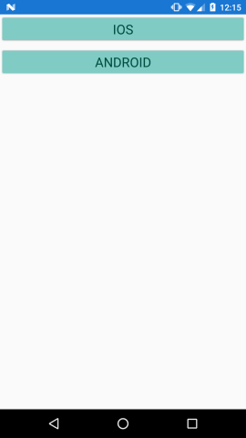
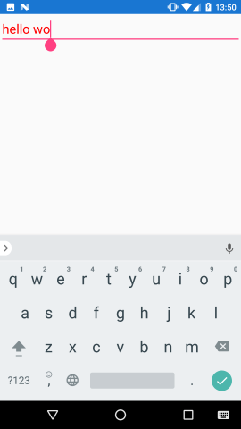
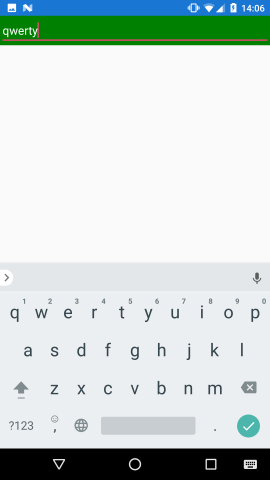
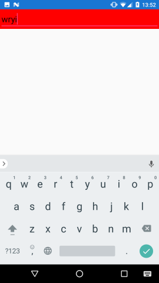

[Домой](https://pavlenkodr.github.io/XamarinStudents/)

# Lesson 4

## Концепция ресурсов в Xamarin Forms

Для совместного использования одних и тех теж компонентов различными элементами Xamarin Forms применяет концепцию ресурсов. В данном случае под ресурсами понимаются не вспомогательные файлы - изображений и т.д., которые используются в приложении, а логические ресурсы, которые определяются в коде C# или XAML.

### Определение ресурсов

В качестве ресурса можно определить любой объект. Все ресурсы помещаются в объект `ResourceDictionary`. У каждого визуального объекта, например, `ContentPage` или `Button`, имеется свойство Resources, которое как раз хранит объект `ResourceDictionary`. Например, определим несколько ресурсов:

```xaml
<?xml version="1.0" encoding="utf-8" ?>
<ContentPage xmlns="http://xamarin.com/schemas/2014/forms"
             xmlns:x="http://schemas.microsoft.com/winfx/2009/xaml"
             x:Class="StylesApp.MainPage">
  <ContentPage.Resources>
    <ResourceDictionary>
      <Color x:Key="textColor">#004D40</Color>
      <Color x:Key="backColor">#80CBC4</Color>
      <x:Double x:Key="fontSize">24</x:Double>
    </ResourceDictionary>
  </ContentPage.Resources>
  <StackLayout>
    <Button Text="iOS" TextColor="{StaticResource Key=textColor}"
      BackgroundColor="{StaticResource Key=backColor}" FontSize="{StaticResource Key=fontSize}" />
    <Button Text="Android" TextColor="{StaticResource Key=textColor}"
      BackgroundColor="{StaticResource Key=backColor}" FontSize="{StaticResource Key=fontSize}" />
  </StackLayout>
</ContentPage>
```

Каждый ресурс должен иметь ключ, задаваемый с помощью атрибута `x:Key`. Это своего рода уникальный идентификатор ресурса. Например:

```xaml
<Color x:Key="textColor">#004D40</Color>
```

Здесь в качестве ресурса определяется объект `Color`. Этот объект имеет ключ `textColor` и значение `#004D40`.

Чтобы обратиться к этому ресурсу в коде, надо использовать расширение `StaticResource`:

```xaml
TextColor="{StaticResource Key=textColor}"
```

Свойство `Key` через ключ ресурса будет ссылаться на данный ресурс.



При этом важно, что на данный ресурс могут ссылаться сразу несколько элементов. Например, мы захотели создать общий для всех кнопок цвет фона. И в этом случае проще определить цветовой ресурс, чем присваивать свойству `BackgroundColor` у каждой кнопки конкретный цвет. А в случае, если мы захотим изметь цвет кнопок на другой, то не надо будет менять свойство `BackgroundColor` у всех кнопок. Достаточно будет поменять значение ресурса.

В то же время при старте приложения ему требуется некоторое время, чтобы найти нужные ресурсы. Поэтому использование ресурсов по сравнению со стандартными значениями немного замедляют работу приложения.

### Специфичные для платформы ресурсы

С помощью ресурсов можно задать легко управлять визуальными параметрами (например, цветом, отступами и т.д.), которые должны быть специфичными для отдельным платформ:

```xaml
<ContentPage.Resources>
    <ResourceDictionary>
        <OnPlatform x:Key="textColor"
            x:TypeArguments="Color"
            iOS="Red"
            Android="Green"
            WinPhone="Blue" />
        <x:Double x:Key="fontSize">22</x:Double>
    </ResourceDictionary>
</ContentPage.Resources>
```

В данном случае в качестве ресурса определяется элемент `OnPlatform`, а через его атрибуты `Android`, `iOS`, `WinPhone` задаются значения для конкретных платформ.

### Уровни ресурсов

Ресурсы могут определяться на трех уровнях:
* На уровне отдельного элемента управления. Такие ресурсы могут применяться ко всем вложенным элементам, которые определены внутри этого элемента
* На уровне всей страницы. Такие ресурсы могут применяться ко всем элементам на странице
* На уровне всего приложения. Эти ресурсы доступы из любого места и из любой страницы приложения.
Выше в примере ресурсы определялись а уровне страницы. Теперь опустимся на уровень ниже и определим их на уровне элемента `StackLayout`:

```xaml
<?xml version="1.0" encoding="utf-8" ?>
<ContentPage xmlns="http://xamarin.com/schemas/2014/forms"
    xmlns:x="http://schemas.microsoft.com/winfx/2009/xaml"
    x:Class="StylesApp.MainPage">
    <StackLayout>
        <StackLayout.Resources>
            <ResourceDictionary>
                <Color x:Key="textColor">#004D40</Color>
                <Color x:Key="backColor">#80CBC4</Color>
                <x:Double x:Key="fontSize">22</x:Double>
            </ResourceDictionary>
        </StackLayout.Resources>
        <Button Text="iOS" TextColor="{StatiБesource Key=textColor}"
            BackgroundColor="{StaticResource Key=backColor}"  FontSize="{StaticResource Key=fontSize}" />
        <Button Text="Android" TextColor="{StaticResource Key=textColor}"
             BackgroundColor="{StaticResource Key=backColor}"  FontSize="{StaticResource Key=fontSize}" />
    </StackLayout>
</ContentPage>
```

По сути результат в данном случае будет от же самый, так как все элементы все равно определены внутри `StackLayout`.

### Ресурсы приложения

Для определения общих для всего приложения ресурсов в VS 2017 в проекте присутствует файл App.xaml, который связан с основным файлом приложения App.xaml.cs. Изменим файл App.xaml следующим образом:

```xaml
<?xml version="1.0" encoding="utf-8" ?>
<Application xmlns="http://xamarin.com/schemas/2014/forms"
             xmlns:x="http://schemas.microsoft.com/winfx/2009/xaml"
             x:Class="StylesApp.App">
    <Application.Resources>
 
        <ResourceDictionary>
            <Color x:Key="textColor">#004D40</Color>
            <Color x:Key="backColor">#80CBC4</Color>
            <x:Double x:Key="fontSize">22</x:Double>
        </ResourceDictionary>
 
    </Application.Resources>
</Application>
```

То есть здесь определены все те же ресурсы, что и ранее, только теперь они будут доступны для любого элемента на любой стрнице внутри приложения.

И в этом случае мы просто можем их использовать:

```xaml
<?xml version="1.0" encoding="utf-8" ?>
<ContentPage xmlns="http://xamarin.com/schemas/2014/forms"
             xmlns:x="http://schemas.microsoft.com/winfx/2009/xaml"
             x:Class="StylesApp.MainPage">
    <StackLayout>
        <Button Text="iOS" TextColor="{StaticResource Key=textColor}"
      BackgroundColor="{StaticResource Key=backColor}"  FontSize="{StaticResource Key=fontSize}" />
        <Button Text="Android" TextColor="{StaticResource Key=textColor}"
      BackgroundColor="{StaticResource Key=backColor}"  FontSize="{StaticResource Key=fontSize}" />
    </StackLayout>
 
</ContentPage>
```

### Управление ресурсами в коде C#

Аналогичный пример использования ресурсов выглядел бы следующим образом:

```cs
public partial class MainPage : ContentPage
{
    public MainPage()
    {
        Color textColor = Color.FromRgb(0, 77, 64);
        Color backColor = Color.FromRgb(128, 203, 196);
        Double fontSize = 21;
        ResourceDictionary resDict = new ResourceDictionary();
        // добавляем ресурсы в словарь
        resDict.Add("textColor", textColor);
        resDict.Add("backColor", backColor);
        resDict.Add("fontSize", fontSize);
        // устанавливаем словарь ресурсов
        this.Resources = resDict;
 
        Button iosButton = new Button { Text = "iOS" };
        // получаем ресурс из словаря
        iosButton.TextColor = (Color)Resources["textColor"];
        iosButton.BackgroundColor = (Color)Resources["backColor"];
        iosButton.FontSize = (double)Resources["fontSize"];
 
        Button androidButton = new Button { Text = "Android" };
        androidButton.TextColor = (Color)Resources["textColor"];
        androidButton.BackgroundColor = (Color)Resources["backColor"];
        androidButton.FontSize = (double)Resources["fontSize"];
 
        Content = new StackLayout
        {
            Children = {iosButton, androidButton}
        };
    }
}
```

Для управления ресурсами применяются методы и свойства ResourceDictionary:
* `Add(string key, object resource)`: добавляет объект с ключом key в словарь, причем в словарь можно добавить любой объект, главное ему сопоставить ключ
* `Remove(string key)`: удаляет из словаря ресурс с ключом key

Чтобы найти ресурс в словаре, достаточно обратиться по ключу:

```cs
androidButton.TextColor = (Color)Resources["textColor"];
```

Так как словарь ресурсов хранит объекты типа object, то при получении ресурса его надо привести к нужному типу.

### Динамические ресурсы

Ресурсы могут быть статическими и динамическими. Рассмотрим разницу на примере:

```xaml
<?xml version="1.0" encoding="utf-8" ?>
<ContentPage xmlns="http://xamarin.com/schemas/2014/forms"
             xmlns:x="http://schemas.microsoft.com/winfx/2009/xaml"
             x:Class="StylesApp.MainPage">
  <ContentPage.Resources>
    <ResourceDictionary>
      <Color x:Key="textColor">Red</Color>
    </ResourceDictionary>
  </ContentPage.Resources>
  <StackLayout>
    <Button Text="Изменить" Clicked="ColorChange" TextColor="{StaticResource Key=textColor}" />
  </StackLayout>
</ContentPage>
```

В файле кода C# добавим обработчик для кнопки:

```cs
private void ColorChange(object sender, EventArgs e)
{
    Color textColor = (Color)Resources["textColor"];
    Resources["textColor"] = textColor == Color.Red ? Color.Green : Color.Red;
}
```

То есть здесь у кнопки цвет текста привязан к ресурсу "textColor". В обработчике кнопки мы пытаемся поменять значение ресурса - если цвет красный, то меняем на зеленый и наоборот.

Однако после запуска приложения и нажатия на кнопку кнопка не поменяет цвет текста, так как ресурс "textColor" установлен как статический. То есть после установки он уже не изменяется. И чтобы изменение срабатывало, данный ресурс надо установить как динамический. Для этого вместо `StaticResource` используется расширение `DynamicResource`:

```xaml
<Button Text="Изменить" Clicked="ColorChange" TextColor="{DynamicResource Key=textColor}" />
```

Весь остальной код остается без изменений.

Стоит отметить, что если `DinamicResource` не найдет нужного ресурса по ключу, то никакой ошибки не возникнет, и приложение также будет работать.

Для установки динамического ресурса в коде применяется метод `SetDynamicResource()`:

```cs
button1.SetDynamicResource(Button.TextColorProperty, "resourceKey");
```

Первый параметр - свойство элемента, а второй - ключ ресурса. Например:

```cs
using System;
using Xamarin.Forms;
 
namespace StylesApp
{
    public partial class MainPage : ContentPage
    {
        public MainPage()
        {
            Color textColor = Color.Red;
            ResourceDictionary resDict = new ResourceDictionary();
            // добавляем ресурсы в словарь
            resDict.Add("textColor", textColor);
 
            // устанавливаем словарь ресурсов
            this.Resources = resDict;
             
            Button androidButton = new Button { Text = "Android" };
            androidButton.SetDynamicResource(Button.TextColorProperty, "textColor");
            androidButton.Clicked += ColorChange;
 
            Content = new StackLayout
            {
                Children = { androidButton }
            };
        }
        private void ColorChange(object sender, EventArgs e)
        {
            Color textColor = (Color)Resources["textColor"];
            Resources["textColor"] = textColor == Color.Red ? Color.Green : Color.Red;
        }
    }
}
```
## Стили
   
Стили позволяют определить набор некоторых свойств и их значений, которые потом могут применяться к элементам. Основная их задача - создать стилевое единообразие для элементов интерфейса. Стили хранятся в ресурсах и отделяют значения свойств элементов от пользовательского интерфейса.

Чтобы понять, как стили упрощают нам работу, рассмотрим простой пример:

```xaml
<?xml version="1.0" encoding="utf-8" ?>
<ContentPage xmlns="http://xamarin.com/schemas/2014/forms"
             xmlns:x="http://schemas.microsoft.com/winfx/2009/xaml"
             x:Class="StylesApp.MainPage">
  <StackLayout>
    <Button Text="iOS" TextColor="#004D40" BackgroundColor="#80CBC4" FontSize="Large" />
    <Button Text="Android" TextColor="#004D40" BackgroundColor="#80CBC4" FontSize="Large" />
  </StackLayout>
</ContentPage>
```

Здесь определены две кнопки, которые фактически имеют один и тот же стиль: одни и те же цвет фона и текста, а также размер текста. Единственное отличие состоит в тексте кнопки.

Однако в данном случае мы вынуждены повторяться и повторно определять один и те же свойства и одни и те же значения для каждого из элементов.

Стили в Xamarin Forms
Теперь применим стили:

```xaml
<?xml version="1.0" encoding="utf-8" ?>
<ContentPage xmlns="http://xamarin.com/schemas/2014/forms"
             xmlns:x="http://schemas.microsoft.com/winfx/2009/xaml"
             x:Class="StylesApp.MainPage">
  <ContentPage.Resources>
    <ResourceDictionary>
      <Style x:Key="buttonStyle" TargetType="Button">
        <Setter Property="TextColor" Value="#004D40" />
        <Setter Property="BackgroundColor" Value="#80CBC4" />
        <Setter Property="FontSize" Value="Large" />
      </Style>
    </ResourceDictionary>
  </ContentPage.Resources>
  <StackLayout>
    <Button Text="iOS" Style="{StaticResource buttonStyle}" />
    <Button Text="Android" Style="{StaticResource buttonStyle}" />
  </StackLayout>
</ContentPage>
```

Стиль создается как ресурс с помощью объекта `Style` и, как любой другой ресурс, он обязательно должен иметь ключ. Атрибут `TargetType` указывает, к какому типу оносится стиль. В данном случае это тип Button.

С помощью коллекции `Setters` определяется группа свойств, входящих в стиль. В нее входят объекты `Setter`, которые имеют следующие свойства:
* `Property`: указывает на свойство, к которому будет применять данный сеттер. При этом свойство должно представлять тип `BindableProperty`
* `Value`: собственно значение свойства

Поскольку стиль определяется как ресурс, то для его установки используются расширения StaticResource или DynamicResource (если стиль динамический):

```cs
<Button Text="iOS" Style="{StaticResource buttonStyle}" />
<Button Text="Android" Style="{DynamicResource buttonStyle}" />
```
Иногда свойство может представлять сложный объект, либо же значение формируется сложным способом. Например, у структуры `Color` есть статический метод `Color.FromRgb()`, который создает цвет по трем значениям. В этом случае мы можем расписать формирование объекта:

```xaml
<Style x:Key="buttonStyle" TargetType="Button">
  <Setter Property="TextColor">
        <Setter.Value>
            <Color>
                <x:Arguments>
                    <x:Double>0</x:Double>
                    <x:Double>0.75</x:Double>
                    <x:Double>0.25</x:Double>
                </x:Arguments>
            </Color>
        </Setter.Value>
    </Setter>
</Style>
```
Также в качестве значения можно устанавливать ссылку на другой ресурс:

```xaml
<ContentPage.Resources>
    <ResourceDictionary>
      <Color x:Key="greenColor">#004D40</Color>
      <Style x:Key="buttonStyle" TargetType="Button">
        <Setter Property="TextColor" Value="{StaticResource Key=greenColor}" />
        <Setter Property="BackgroundColor" Value="#80CBC4" />
        <Setter Property="FontSize" Value="Large" />
      </Style>
    </ResourceDictionary>
</ContentPage.Resources>
```

### TargetType

Если нам надо создать общий стиль для элементов определенного типа, то можно не задавать ключ ресурса, а достаточно установить у стиля атрибут `TargetType`, в который передается тип элементов:

```xaml
<ContentPage.Resources>
  <ResourceDictionary>
    <Color x:Key="greenColor">#004D40</Color>
    <Style TargetType="Button">
      <Setter Property="TextColor" Value="{StaticResource Key=greenColor}" />
      <Setter Property="BackgroundColor" Value="#80CBC4" />
      <Setter Property="FontSize" Value="Large" />
    </Style>
  </ResourceDictionary>
</ContentPage.Resources>
<StackLayout>
  <Button Text="iOS" />
  <Button Text="Android" />
</StackLayout>
```
Теперь у кнопок не надо будет указывать ресурс стиля, так как стиль будет автоматически применяться ко всем объектам типа, который указан в атрибуте `TargetType`.

### Переопределение стилей
Стиль позволяет задать некоторые начальные значения. Однако элемент может переопределить отдельные значения из стиля:

```xaml
<?xml version="1.0" encoding="utf-8" ?>
<ContentPage xmlns="http://xamarin.com/schemas/2014/forms"
             xmlns:x="http://schemas.microsoft.com/winfx/2009/xaml"
             x:Class="StylesApp.MainPage">
    <ContentPage.Resources>
        <ResourceDictionary>
            <Style x:Key="buttonStyle" TargetType="Button">
                <Setter Property="TextColor" Value="#004D40" />
                <Setter Property="BackgroundColor" Value="#80CBC4" />
                <Setter Property="FontSize" Value="Large" />
            </Style>
        </ResourceDictionary>
    </ContentPage.Resources>
    <StackLayout>
        <Button Text="Android" Style="{StaticResource buttonStyle}" TextColor="Red" />
    </StackLayout>
</ContentPage>
```
В данном случае кнопка получает все значения из стиля `buttonStyle`, однако переопределяет цвет текста, так как прямое использование атрибутов элемента имеет приоритет над приеняемым стилем.

### Установка стилей в коде
Для создания стиля в коде используется объект `Style`:

```xaml
using Xamarin.Forms;
 
namespace StylesApp
{
    public partial class MainPage : ContentPage
    {
        public MainPage()
        {
            Resources = new ResourceDictionary
            {
                {
                    "buttonStyle", new Style(typeof(Button))
                    {
                        Setters =
                        {
                            new Setter
                            {
                                Property = Button.TextColorProperty,
                                Value = Color.FromRgb(0, 77, 64)
                            },
                            new Setter
                            {
                                Property = Button.BackgroundColorProperty,
                                Value = Color.FromRgb(128, 203, 196)
                            },
                            new Setter
                            {
                                Property = Button.FontSizeProperty,
                                Value = Device.GetNamedSize(NamedSize.Large, typeof(Button))
                            }
                        }
                    }
                }
            };
 
            Button button1 = new Button { Text = "iOS", Style=(Style)Resources["buttonStyle"] };
            Button button2 = new Button { Text = "Android", Style = (Style)Resources["buttonStyle"] };
             
            Content = new StackLayout
            {
                Children = {button1, button2}
            };
        }
    }
}
```
В конструктор объекта `Style` передается тип, для которого предназначен данный стиль - аналогично использованию атрибута `TargetType` в `XAML`.

При создании стиля в коде следует учитывать, что в качестве свойств указываются именно `BindableProperty` (как правило называется по имени обычного свойства с суффиксом `Property`). Например:

```cs
Property = Button.TextColorProperty
```
А не просто TextColor. Причем в начале идет тип (в данном случае `Button`), а потом идет название свойства (здесь `TextColorProperty`).

Правда, здесь надо отметить, что в коде помещать стиль в ресурсы не имеет смысла, так как мы можем напрямую присвоить кнопке или другому элементу определенный стиль:

```cs
public partial class MainPage : ContentPage
{
    public MainPage()
    {
        Style buttonStyle = new Style(typeof(Button))
        {
            Setters =
            {
                new Setter
                {
                    Property = Button.TextColorProperty,
                    Value = Color.FromRgb(0, 77, 64)
                },
                new Setter
                {
                    Property = Button.BackgroundColorProperty,
                    Value = Color.FromRgb(128, 203, 196)
                },
                new Setter
                {
                    Property = Button.FontSizeProperty,
                    Value = Device.GetNamedSize(NamedSize.Large, typeof(Button))
                }
            }
        };
        Button button1 = new Button { Text = "iOS", Style=buttonStyle};
        Button button2 = new Button { Text = "Android", Style = buttonStyle };
             
        Content = new StackLayout
        {
            Children = {button1, button2}
        };
    }
}
```

### Наследование стилей
С помощью свойства `BasedOn` можно наследовать один стиль от другого. Например:

```xaml
<?xml version="1.0" encoding="utf-8" ?>
<ContentPage xmlns="http://xamarin.com/schemas/2014/forms"
             xmlns:x="http://schemas.microsoft.com/winfx/2009/xaml"
             x:Class="StylesApp.MainPage">
  <ContentPage.Resources>
    <ResourceDictionary>
      <Style x:Key="baseButtonStyle" TargetType="Button">
        <Setter Property="FontSize" Value="Large" />
        <Setter Property="FontFamily" Value="Verdana" />
        <Setter Property="TextColor" Value="Red" />
      </Style>
      <Style x:Key="greenButtonStyle" TargetType="Button" BasedOn="{StaticResource Key=baseButtonStyle}">
        <Setter Property="TextColor" Value="#004D40" />
        <Setter Property="BackgroundColor" Value="#80CBC4" />
      </Style>
    </ResourceDictionary>
  </ContentPage.Resources>
  <StackLayout>
    <Button Text="iOS" Style="{StaticResource Key=greenButtonStyle}" />
    <Button Text="Android" Style="{StaticResource Key=greenButtonStyle}" />
  </StackLayout>
</ContentPage>
```

Здесь у стиля `greenButtonStyle` атрибут `BasedOn` указывает на другой стиль baseButtonStyle. И таким образом, стиль `greenButtonStyle` будет перенимать все установки от baseButtonStyle. При этом наследующий стиль может переопределить значения из наследуемого. В частости, здесь переопределяется значение свойства `TextColor`.

При наследовании стилей важно, чтобы тип элементов, указанный в качестве значения атрибута `TargetType`, совпадал. Например, в данном случае оба стиля применяется к элементам типа `Button`.

Наследование в коде осуществляется с помощью установки у стиля свойства `BasedOn`:

```cs
Style basedStyle = new Style(typeof(Button));
Style childStyle = new Style(typeof(Button))
{
    BasedOn = basedStyle
};
```

### Встроенные стили

Xamarin Forms предоставляет ряд встроенных стилей, которые мы можем использовать:
* `BodyStyle`: стиль для текста страницы
* `CaptionStyle`: стиль для подписей к изображениям и т.д.
* `ListItemDetailTextStyle`: стиль для детального описания в списке
* `ListItemTextStyle`: стиль для текста элемента списка
* `SubtitleStyle`: стиль для подзаголовка
* `TitleStyle`: стиль для заголовка страницы

В то же время эти стили имеют ограничения: они применяются только к элементу `Label` и устанавливают стилевые настройки только для текста метки.

Применение стилей:

```xaml
<Label Text="Заголовок" Style="{DynamicResource TitleStyle}" />
```

## Триггеры

Триггеры в Xamarin Forms позволяют декларативно задать некоторые действия, которые выполняются при изменении свойств визуального объекта.

### Триггеры свойств

Простые триггеры свойств определяются как элементы стиля с помощью объекта `Trigger`. Они следят за значением свойств и в случае их изменения с помощью объекта `Setter` устанавливают значение других свойств.

Например, пусть по переходу к текстовому полю `Entry` текст в нем приобретает красный цвет:

```xaml
<?xml version="1.0" encoding="utf-8" ?>
<ContentPage xmlns="http://xamarin.com/schemas/2014/forms"
             xmlns:x="http://schemas.microsoft.com/winfx/2009/xaml"
             x:Class="StylesApp.MainPage">
  <ContentPage.Resources>
    <ResourceDictionary>
      <Style x:Key="entryStyle" TargetType="Entry">
        <Style.Triggers>
          <Trigger Property="Entry.IsFocused" Value="True" TargetType="Entry">
            <Setter Property="TextColor" Value="Red" />
          </Trigger>
        </Style.Triggers>
      </Style>
    </ResourceDictionary>
  </ContentPage.Resources>
  <StackLayout>
    <Entry FontSize="Large" Style="{StaticResource Key=entryStyle}" />
  </StackLayout>
</ContentPage>
```

Стиль может содержать несколько триггеров, и все они определяются в элементе `Style.Triggers`.

У каждого триггера устанавливаются три свойства:
* `Property`: свойство, на изменение которого должен отслеживать триггер
* `Value`: значение свойства, при котором должен срабатывать триггер
* `TargetType`: тип объектов, к которым применяется триггер

То есть триггер в данном случае будет срабатывать, когда свойство `IsFocused` элемента `Entry` приобритет значение `true`.

Работа триггера будет заключаться в установки ряда свойств элемента `Entry`. Здесь у `Entry` устанавливается красный текст:

```xaml
<Setter Property="TextColor" Value="Red" />
```

Таким образом, при получении фокуса сработает триггер, который окрасит текст в красный цвет.



### Триггеры в Xamarin Forms
Зато, когда мы установим фокус в другом месте приложения на какой-то другой элемент, то триггер уже действовать не будет, а текст в Entry приобретет свой стандартный цвет:


### Триггеры свойств в коде C#
Определим триггеры свойств в коде C#:

```cs
public partial class MainPage : ContentPage
{
    public MainPage()
    {
        Entry entry = new Entry();
         
        // определяем триггер для элемента Entry
        var trigger = new Trigger(typeof(Entry))
        {
            Property = Entry.IsFocusedProperty,
            Value = true
        };
        // установка зеленого фона
        trigger.Setters.Add(new Setter
        {
            Property = Entry.BackgroundColorProperty,
            Value = Color.Green
        });
        // установка белого цвета текста
        trigger.Setters.Add(new Setter
        {
            Property = Entry.TextColorProperty,
            Value = Color.White
        });
        // добавляем триггер
        entry.Triggers.Add(trigger);
 
        Content = new StackLayout
        {
            Children = { entry }
        };
    }
}
```
Вначале определяем триггер с помощью объекта `Trigger`. Через свойство `Property` указываем свойства элемента `Entry`, которое будет отслеживаться. А с помощью свойства `Value` устанавливаем значение, при получении которого сработает триггер.

```cs
var trigger = new Trigger(typeof(Entry))
{
    Property = Entry.IsFocusedProperty,
    Value = true
};
```

То есть когда свойство `IsFocused` получит значение `true`, сработает триггер.

Далее через коллекцию `Setters` определяем свойства и их значения, которые будут устанавливаться во время действия триггера - установка зеленого цвета фона и белого цвета для введенных символов.

В конце триггер добавляется в коллекцию `Triggers` элемента `Entry`:

```cs
entry.Triggers.Add(trigger);
```
В итоге при получении фокуса тестовое поле будет окрашиваться в зеленый цвет, а введенные символы - в белый:



Но пойдем чуть дальше и добавим к триггеру дополнительные действия. Действие в триггере - это обычный класс, который наследуется от класса `TriggerAction` и который реализует метод `Invoke()`. Так, определим следующий класс:

```cs
public class FocusTriggerAction : TriggerAction<Entry>
{
    protected override void Invoke(Entry sender)
    {
        if (sender.IsFocused)
            sender.FadeTo(1);
        else
            sender.FadeTo(0.5);
    }
}
```

Поскольку это действие будет применяться к элементу `Entry`, то базовый класс типизируется типом `Entry`. В метод `Invoke` в качестве параметра передается элемент `Entry`, к которому применяется триггер. В методе `Invoke` проверяем, имеет ли текстовое поле фокус, и если имеет, то делаем его непрозрачным, иначе делаем его наполовину прозрачным.

Теперь используем это действие:

```cs
public class MainPage : ContentPage
{
    public MainPage()
    {
        Entry entry = new Entry();
             
        var trigger = new Trigger(typeof(Entry))
        {
            Property = Entry.IsFocusedProperty,
            Value = true
        };
        trigger.Setters.Add(new Setter
        {
            Property = Entry.BackgroundColorProperty,
            Value = Color.Green
        });
        trigger.Setters.Add(new Setter
        {
            Property = Entry.TextColorProperty,
            Value = Color.White
        });
        trigger.EnterActions.Add(new FocusTriggerAction());
        trigger.ExitActions.Add(new FocusTriggerAction());
             
        entry.Triggers.Add(triggers);
 
        Content = new StackLayout
        {
            Children = { entry }
        };
    }
}
```

Класс `Trigger` определяет два специальных свойства: `EnterActions` (хранит действия, которые применяются при срабатывании триггера) и `ExitActions` (хранит действия, которые выполняются, когда триггер перестает действовать). Причем в обе эти коллекции-свойства передается `FocusTriggerAction`, что позволит включить действие при включении триггера и отключать при отключении триггера.

### Триггеры событий
Триггеры событий вызываются в ответ на события элемента. Но чтобы использовать триггер событий, нам надо вначале создать действие, которое будет вызываться триггером. .

Итак, добавим в наш проект следующий класс:

```cs
public class EntryValidation : TriggerAction<Entry>
{
    protected override void Invoke(Entry sender)
    {
        int number;
        if (!Int32.TryParse(sender.Text, out number))
            sender.BackgroundColor = Color.Red;
        else
            sender.BackgroundColor = Color.Default;
    }
}
```

В данном случае мы будем ожидать ввод только цифр в поле `Entry`. Если же будут введены нецифровые символы, то поле окрасится в красный цвет.

Теперь применим это действие:

```xaml
<?xml version="1.0" encoding="utf-8" ?>
<ContentPage xmlns="http://xamarin.com/schemas/2014/forms"
             xmlns:x="http://schemas.microsoft.com/winfx/2009/xaml"
             xmlns:local="clr-namespace:StylesApp;assembly:StylesApp"
             x:Class="StylesApp.MainPage">
  <ContentPage.Resources>
    <ResourceDictionary>
      <Style x:Key="entryStyle" TargetType="Entry">
        <Style.Triggers>
          <EventTrigger Event="TextChanged">
            <local:EntryValidation />
          </EventTrigger>
        </Style.Triggers>
      </Style>
    </ResourceDictionary>
  </ContentPage.Resources>
  <StackLayout>
    <Entry FontSize="Large" Style="{StaticResource Key=entryStyle}" />
  </StackLayout>
</ContentPage>
```

Триггер событий также определяется в элементе `Style.Triggers`, только теперь он представлен объектом `EventTrigger`.
Атрибут `Event` этого объекта указывает на событие, при возникновении которого будет вызываться триггер. В данном случае это событие `TextChanged`, то есть изменение текста в поле `Entry`.
И в самом `EventTrigger` определяется наше действие `EntryValidation`.
В итоге, если мы введем в поле нецифровые символы, то это поле окрасится в красный цвет:



### Триггеры событий в коде
У визуальных элементов есть свойство `Triggers`, которое мы можем использовать для добавления триггера:

```cs
public partial class MainPage : ContentPage
{
    public MainPage()
    {
        Entry entry = new Entry();
        var trigger = new EventTrigger()
        {
            Event = "TextChanged"
        };
        trigger.Actions.Add(new EntryValidation());
        entry.Triggers.Add(trigger);
 
        Content = new StackLayout
        {
            Children = { entry }
        };
    }
}
```

Вначале собственно создается триггер - объект `EventTrigger`, и с помощью свойства `Event` у него устанавливается событие.

Далее в коллекцию `Actions` в триггере добавляется объект `EntryValidation`, а затем сам триггер добавляется в коллекцию `Triggers` у элемента `Entry`.

Результат работы будет аналогичен действию кода в `xaml`.

[Примеры использования тут](https://github.com/PavlenkoDR/XamarinStudents/tree/master/Lesson4/Example/Example/Example)

## Необходимые ссылки

1. [Концепция ресурсов в Xamarin Forms](https://metanit.com/sharp/xamarin/9.1.php)
2. [Стили](https://metanit.com/sharp/xamarin/9.2.php)
3. [Триггеры](https://metanit.com/sharp/xamarin/9.3.php)
